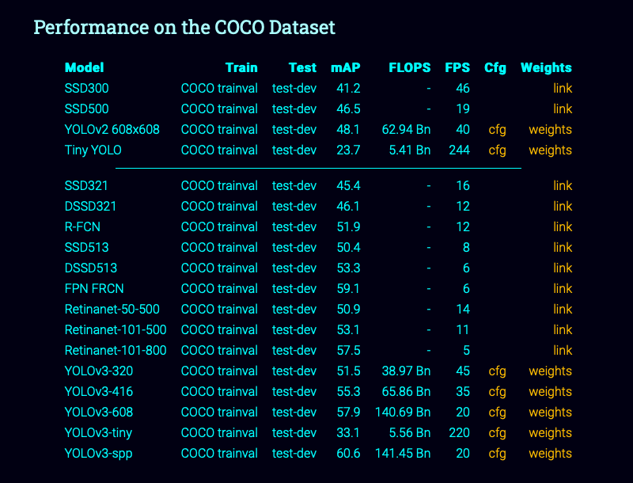
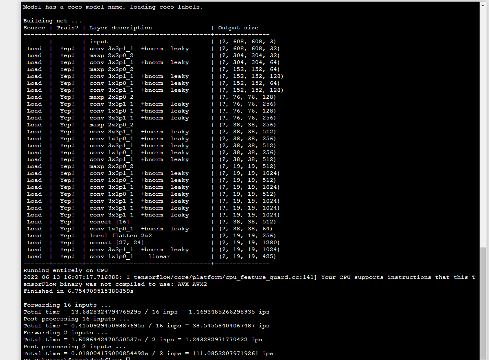
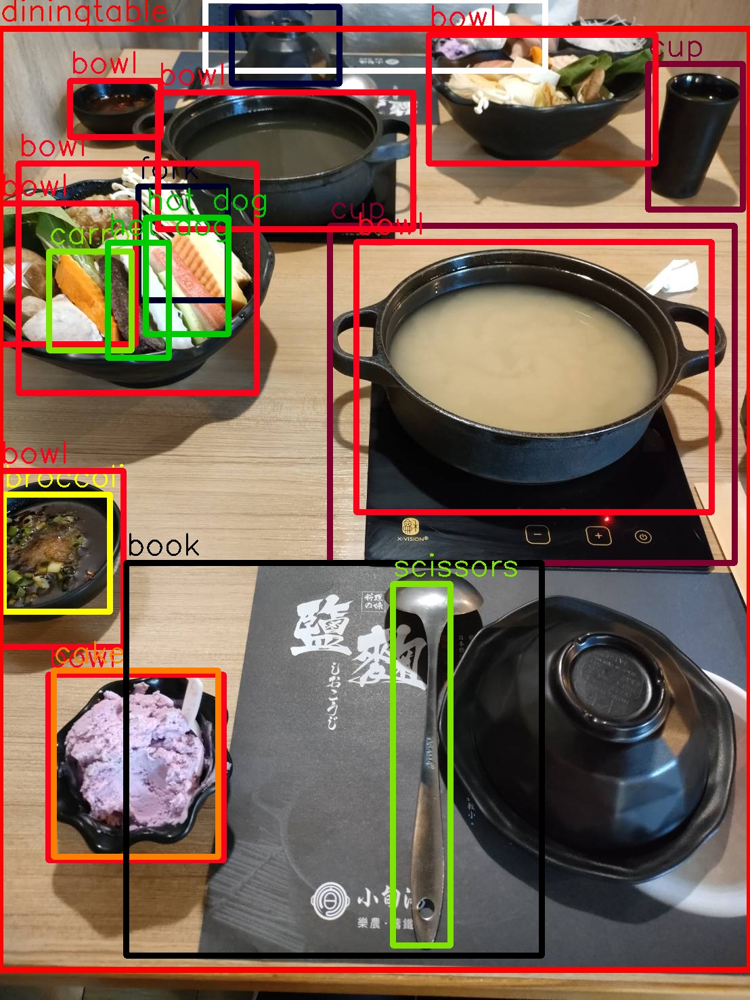
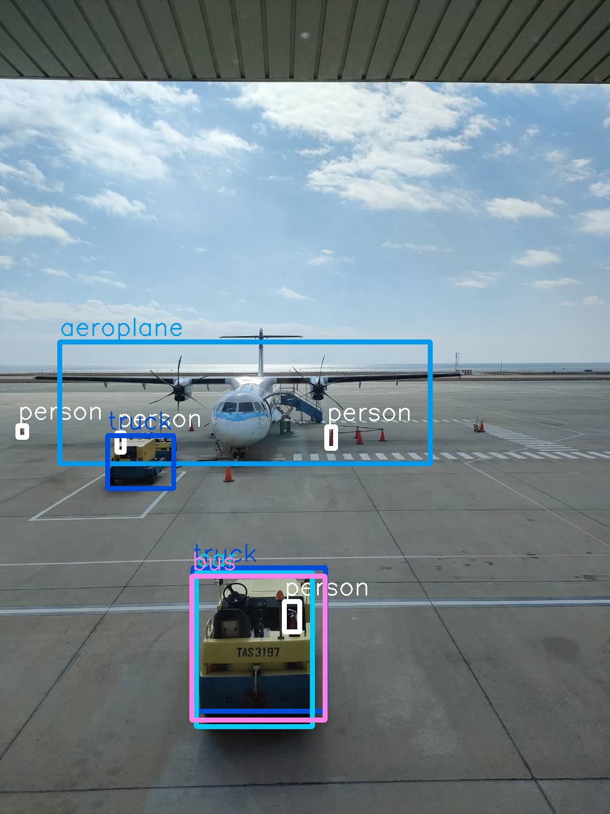
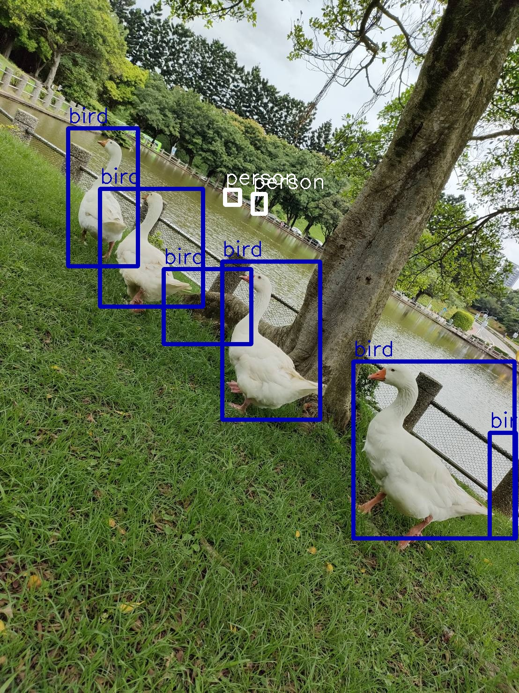
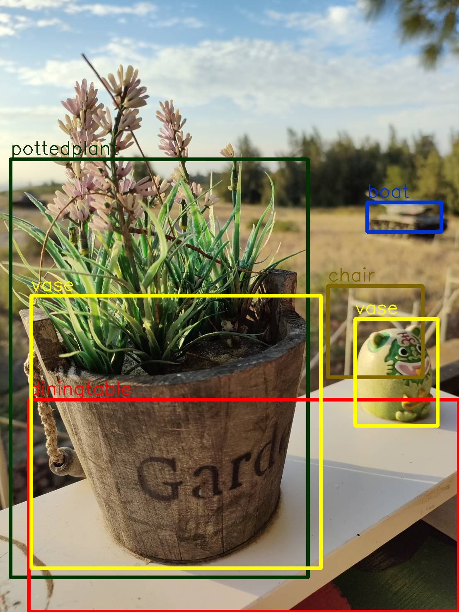

# 本程式參考 darkflow 專案
# AI (Aritificial Intelligence)
## 人工智慧
```
是指由人類製造出能表現出智慧的機器，通常是透過電腦程式來呈現人類智慧的技術。
人工智慧之父 (Alan Mathison Turing)， 提出圖靈測試的實驗，目的在測試機器能否表現出智慧。
人工智慧目前在電腦領域具有極大的影響力，並在機器人、控制系統、經濟政治決策等多個領域使用。
```
## 機器學習
```
主要目的是為了讓機器從使用者和輸入資料等地方獲得知識，然後讓機器自動去判斷和輸出相應的結果。
機器學習主要分為監督和非監督兩類。
監督式學習：會給機器訓練樣本並且告知樣本的類別，再依據這些樣本類別進行訓練，提取樣本的共同屬性或訓練一個分類器，
最後新來的樣本則透過訓練得到數據進行判斷樣本的類別。
非監督式學習：不會給定訓練樣本，而是直接給一些樣本和規則，讓機器自動依據規則進行分類。
```
## 人工智慧基本應用
### 1.感知 (Perception)
```
指AI學習人類的五官感知能力。
看：電腦視覺(Computer Vision)、圖像辨識(Image Recognition)、臉部辨識(Face Recognition)、物件偵測(Object Detection)
聽：語音辨識(Sound Recognition)
說：語音生成(Sound Generation)、文字轉語音(Text-to-Speech)
讀：自然語言處裡(Natural Language Processing)、語音轉文字(Speech-to-Text)
寫：機器翻譯(Machine Translation)
```
### 2.認知 (Cognition)
```
指學習模仿人類瞭解訊息獲取知識的能力。
分析辨識能力：醫學圖像分析、產品推薦、垃圾郵件辨識、犯罪偵測、消費行為分析
預測能力：天然災害預測防治、AI的預防性維修(Predictive Maintenance)
判斷能力：AI下圍棋、自動駕駛車、癌症判斷
學習能力：機器學頤、深度學習、增強式學習等各種學習方法
```
### 3.創造力 (Creativity)
```
指學習人類創造新事物的能力，主要有AI作曲、AI繪畫、AI設計等領域。
```
### 4.智慧 (Wisdom)
```
指人類能探求真實真理，明辨是非的能力，在這個領域牽涉人類自我意識、認知與價值觀，是AI目前最難模仿的領域。
```

# YOLOv2 實作
## 準備好環境後去把 darkflow 從 github clone 下來 
```
https://github.com/thtrieu/darkflow
```
## 安裝好 darkflow 後，去官網下載事先訓練好的 weight 放在 darkflow 下的 bin 目錄。
```
https://pjreddie.com/darknet/yolo/
```


## 去 terminal 輸入以下 code 測試 YOLO 是否安裝成功。
```
python flow --model cfg/yolo.cfg --load bin/yolov2.weights --imgdir sample_img/
```
## 以下是拿自己的照片測試結果，目前還未自行訓練 weight 去辨識（等我有空 * >< *







# References
[1].https://pjreddie.com/darknet/yolo/

[2].https://github.com/thtrieu/darkflow

[3].https://medium.com/雞雞與兔兔的工程世界/機器學習-ml-note-yolo-利用影像辨識做物件偵測-object-detection-的技術-3ad34a4cac70
