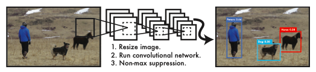
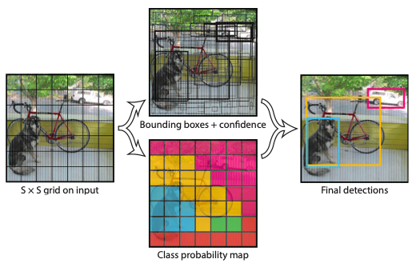
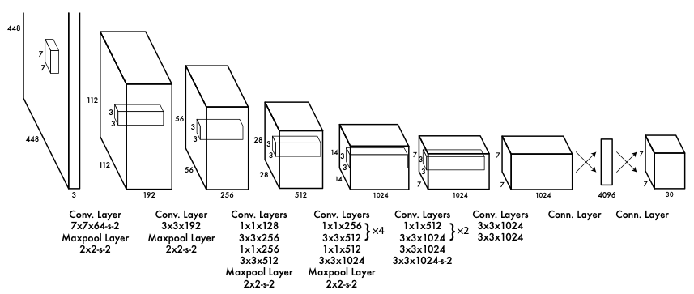
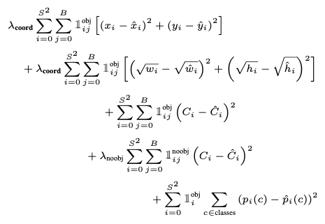
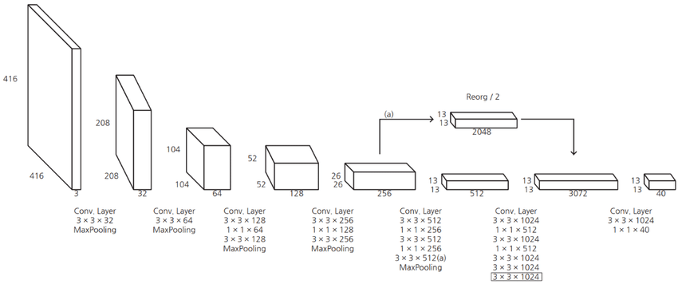
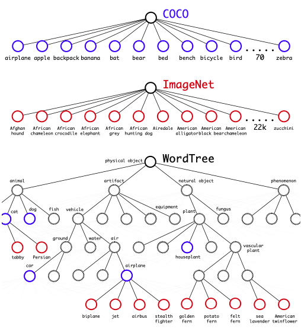
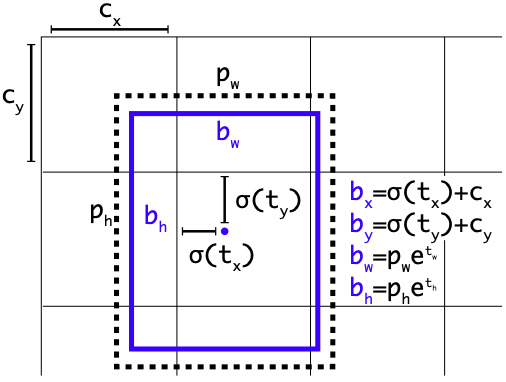
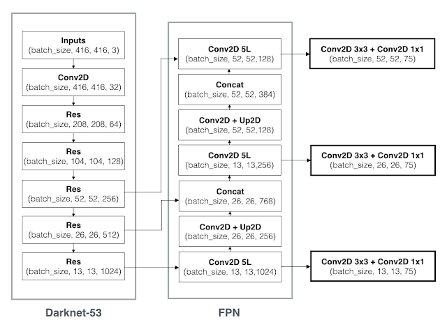

#  YOLO Notes 
## 以下是閱讀論文的筆記，參考來自網路上閱讀心得，底下有連結。

## Paper
### YOLOv1: https://arxiv.org/pdf/1506.02640.pdf
### YOLOv2: https://arxiv.org/pdf/1612.08242.pdf
### YOLOv3: https://pjreddie.com/media/files/YOLOv3.pdf
#
# You Only Look Once: Unified, Real-Time Object Detection(YOLOv1)
## Kernel

## YOLO將目標檢測視為迴歸問題。整個過程分為3個階段： 
```
（1）將輸入圖像的大小調整為 448 * 448 
（2）在圖像上透過單個神經網路進行檢測和分類 
（3）再使用 NMS 抑制(Non-max suprresed)，輸出最終結果
```
#
## Introduction

```
YOLO 會先將輸入的圖像劃分成 S * S 的網格，如果物件中心落入某一個網格，那個網格就負責檢測該物件。
每個網格預測 B 個 Bounding Box 和 C 個類別(最終輸出 S*S*(B*5+C) 維向量)。
C : 類別數
S : 網格數量
B : 每格預測的 Bounding Box 數 (YOLO v1 Set B =2)
```
```
每一個 Bounding Box 包含5個值：
x : 為 Bounding Box 中心點x座標
y : 為 Bounding Box 中心點y座標
w : 為 Bounding Box 寬
h : 為 Bounding Box 高
confidence : Bounding Box 是包含目標的信心值。
```
## Pr(Classi|Object) ∗ Pr(Object) ∗ IOUtruth = Pr(Classi) ∗ IOUtruth
```
IOU : 表示預測 Bounding Box 與真實標註位置衡量準確度的公式(两个框交集的面積/两个框聯集的面積)。
Confidence 是條件類別機率，Pr(Classi|Object)。
如果在網格沒有任何物件，這時候 Confidence 就會是 0;
反之物件在網格內，最好的情況就是 Confidence 等於預測類別的機率乘以 Ground Truth 的 IOU ，
這個分數衡量了該類別出現在 Box 中的機率以及該 Box 與目標的符合程度。
```
## Network Architecture

```
YOLOv1 神經網路部分參考了 GoogLeNet ，以 224 * 224 的資料集做預訓練，
輸入圖像大小為 448 * 448 ，經過 24 層卷積層，變為 7 * 7 * 1024 的張量(tensor)，
最後經過 2 個全連接層，輸出為 7 * 7 * 30 的張量。
```
#
## Loss Function

```
所有的損失都是使用平方和誤差公式，輸入的預測數值及造成的損失：
（1）預測框的中心點 (x,y)，如果物件存在於該網格格子中，則該值為 １;反之為 0。
    對那些有真實物件的網格進行計算，若該網格不包含物件，那麽预测数值不會對損失函数造成影響。
（2）預測框的寬高 (w,h)，也是只有真實物件的網格才會造成損失。
    其中在損失函数中取了根號，如果不取根號，損失函数通常會傾向調整尺寸較大的预测框。
（3）預測框的 Confidence ，當該網格不含物件時，置信度的值為0；
    若包含物件時，該置信度的值為预测框與真實物件框的 IOU 数值。
（4）物件類別機率，對應的類别位置数值為 1，其他位置為 0。
```
#
# Summary
```
從 RCNN, fast RCNN, faster RCNN 發展到 YOLO ，其特色是直接端對端進行物件偵測。
使用整張圖像作為神經網路的輸入，直接預測 Bounding Box 座標位置，
Bounding Box 含物件的 Confidence 和物件所屬的類別。
YOLOv1 能達到 Real-time 速度需求，但對於位置的預測卻不夠準確，且在小物件的預測效果較差。
```
#
# YOLO9000:Better,Faster,Stronger (YOLOv2)
## Introduction
```
此篇介紹了 YOLOv2 & YOLO9000 ， YOLOv2 為 YOLOv1 進階版;
YOLO9000 是一個即時的框架，利用聯合最佳化檢測與分類來檢測超過9000種物件類別。
```
## Network Architecture(Darknet-19)

```
相對於 YOLOv1 幾個部分進行修改：
（1）Batch normalization: 捨棄 Dropout ，每層加上 Batch Normalization(BN)。
（2）Anchor box: 捨棄YOLO v1 預測 Bounding Box 的方法而改用 faster RCNN 的 anchor box。
（3）增加解析度：輸入圖像大小 448 * 448 改成 416 * 416 ，使最後特徵圖恰好只有一個中心。
（4）Passthrough Layer:透過堆疊相鄰的特徵到不同的通道，將高、低解析度的特徵串接起來，類似於ResNet的恆等映射。
```
## WordTree

```
使用 WordTree 以合理的方式結合多種來源資料，將多個資料集結合在一起。
上圖說明使用 WordTree 結合 ImageNet 與 COCO 標記的範例。
```
#
# YOLOv3: An Incremental Improvement(YOLOv3)
## Introduction
```
YOLOv3 相對於 YOLOv2 主要是針對 Bounding Box 數量及對小物件的偵測能力進行加強。
```
## Bounding Box Prediction

```
在訓練時使用 Error Sum of Squares Loss(SSE Loss)，
對每 Ground Truth 只分配一個最佳的 Bounding box。
```
## Network Architecture(Darknet-53)

```
YOLOv3 提出 Darknet-53 替代 YOLOv2 的 Darknet-19。
（1）使用 ResNet 網路:將前一層特徵用跳躍連接的方式傳遞到下一層，解決梯度問題。
（2）使用 Feature Pyramid Network(FPN) 網路:提升小物體預測能力，
    特徵層有 13 * 13, 26 * 26, 52 * 52 三種尺寸。
```
#
## References
[1].https://medium.com/chiukevin0321/yolo-v1-v2-v3-35af83a8b29b

[2].https://medium.com/@afly.bsky/yolo-v1-物件偵測-論文整理-935bfd51d5e0

[3].https://hackmd.io/@shaoeChen/Hy6kUMWNI

[4].https://hackmd.io/@shaoeChen/r1TTbG2OL

[5].https://medium.com/@afly.bsky/yolo-v2-物件偵測-論文整理-a8e11d8b4409

[6].https://mropengate.blogspot.com/2018/06/yolo-yolov3.html

[7].https://www.maskaravivek.com/post/yolov2/#

[8].https://medium.com/@afly.bsky/yolo-v3-物件偵測-論文整理-11ee909430c8

[9].https://medium.com/image-processing-and-ml-note/yolov3-you-only-look-once-object-detection-13a312c7336f