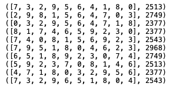

## 加分題: 使用爬山演算法求解TSP

## TSP:
```
“給定一個城市列表和每對城市之間的距離，訪問每個城市一次並返回到原城？” 
```
## Hill climbing Algorithm:
```
Hill climbing 是一種迭代算法，從問題的任意解決方案開始，透過對解決方案進行 Incremental heuristic search 找更好的解決方案。
如果更改產生更好的解決方案便在此基礎上繼續進行 Incremental heuristic search 直到找不到更好的解決方案。
```
## Steps:
```
1.去生成創建一個大問題 (共10個城市)
2.創建一個隨機解決方案生成器
3.創建一個計算路線長度的函數
4.創建一個生成解決方案所有鄰居的函數
5.創建一個尋找最佳鄰居的函數
6.創建爬山算法
```
## Code:
### [Here](./main.py)
## Output:

## References:
```
1. https://towardsdatascience.com/how-to-implement-the-hill-climbing-algorithm-in-python-1c65c29469de
```