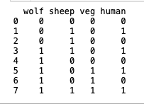

# 狼、羊、甘藍菜跟人過河的問題：

## Problem:
```
一個人帶著一隻狼，一隻羊，一顆菜要過河，船一次只能載一個人和一個東西往返河的兩岸。
此外，人不在時，狼會吃掉羊，羊會吃掉菜。
如何將三個東西完好的帶去對岸。
```

## Steps:
```
step1: 人 帶 [羊] "去" 對岸
step2: 人 從對岸 '回來'
step3: 人 帶 [狼] "去" 對岸
step4: 人 帶 [羊] 從對岸 '回來'
step5: 人 帶 [菜] "去" 對岸
step6: 人 從對岸 '回來'
step7: 人 帶 [羊] "去" 對岸
```

## Program:
### [Code Is Here~~~](./main.py)

### Result:

